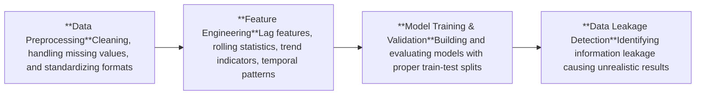

# Delhi Air Quality Index Prediction
## Introduction
This project develops a comprehensive machine learning pipeline for predicting Air Quality Index (AQI) in Delhi, India. The system makes use of historical environmental monitoring data from multiple government sources to forecast air quality conditions, supporting public health advisories and urban planning decisions.

### Motivation

### Objectives

## Dataset

### Sources
### Format

## Methodology

## ML Pipeline Flowdiagram

