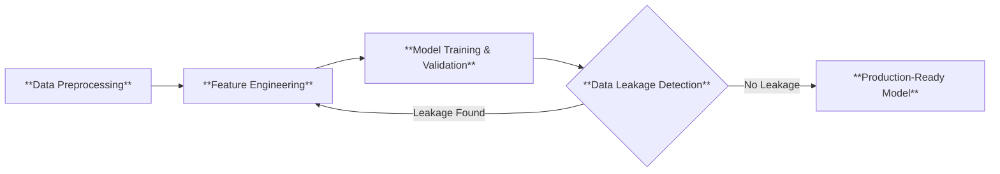

# 😷 Delhi Air Quality Index Prediction
## 📖 Introduction

This project develops a comprehensive machine learning pipeline for predicting Air Quality Index (AQI) in Delhi, India. The system makes use of historical environmental monitoring data from multiple government sources to forecast air quality conditions, supporting public health advisories and urban planning decisions.

### Motivation

This project was made during a time when Delhi was gripped by an air pollution crisis. The AQI was getting so bad that the readings were starting to dip in the severe category for multiple days in a row. However, at some point the govt. decided to fudge the data or not show it at all. Which infuriated me to no end. Thereofre, I decided to put my AI/ML skills to good use and (try to) make my own predictor model.

###  Objectives

- Build an end-to-end ML pipeline from raw data to deployment-ready model.
- Process and integrate data from multiple heterogeneous monitoring sources.
- Chart out meaningful features capturing patterns and environmental trends.
- Develop a robust prediction model with realistic  performance.

## 🗂️ Dataset

The data was gathered from the Central Pollution Copntrol Board repository ([Link](https://airquality.cpcb.gov.in/ccr/#/caaqm-dashboard-all/caaqm-landing/aqi-repository)). 6 years worth of data was downloaded (2018-2024). The readings within this repo were measured and provided by multiple government institutes, they were:

| Source | Description | 
|-------|----------------------|
| DPCC |Delhi Pollution Control Committee monitoring data |
| CPCBB | Central Pollution Control Board national monitoring network | 
| IMD | India Meteorological Department weather data |
| IITM |Indian Institute of Tropical Meteorology research data|

The dataset consists of daily AQI measurements from 2018-2024 for 37 monitoring stations, all within Delhi. These stations are:

### Dataset issues

- <ins>**Missing/NULL Values:**</ins> The raw data had empty cells scattered throughout, requiring systematic handling to avoid dropping too many records or introducing bias.
- <ins>**Multi-Source Data Integration:**</ins> Data came from different sources (DPCC, CPCB, IMD, IITM) with varying formats, requiring standardization into a unified structure.
- <ins>**Wide-to-Long Format Transformation:**</ins> The raw data was in wide format (months as columns, days as rows) and needed transformation to long format (one row per date-station combination) for ML modeling.

## ⚙️ Methodology

### ML Pipeline Flowdiagram

### Data Preprocessing

Raw data underwent extensive cleaning and standardization including handling missing values through interpolation, normalizing column names across sources, removing duplicate records, and converting timestamps to consistent formats. The preprocessing pipeline was designed to adapt to format variations across different data sources and time periods.

### Feature Engineering

A comprehensive feature set was developed to capture the complexity of environmental data:

- <ins>**Lag Features:**</ins> Previous hour, day, and week AQI values to capture short and medium-term patterns

- <ins>**Rolling Statistics:**</ins> Moving averages, standard deviations, and min/max over 6, 12, 24, and 72-hour windows

- <ins>**Temporal Features:**</ins> Hour of day, day of week, month, season, and holiday indicators

### Training

Regression models like Linear Regression (baseline), Ridge and Lasso Regression, Decision Tree, and Random Forest were evaluated with strict temporal ordering to prevent data leakage. Out of which, the Random Forest Classifier emerged as the bbest perfomer.

### Testing

Time series cross-validation was conducted. The train-test split of the data maintained a chronological integrity, ensuring the model was only evaluated on future data it had not seen during training.

## 📊 Results

The baseline uses a simple "persistence" approach: tomorrow's AQI = today's AQI. It assumes air quality doesn't change much day-to-day. This is surprisingly effective for time series data and serves as the minimum benchmark any ML model should beat.

| Metric | Baseline | Random Forest | Description |
|--------|----------|---------------|-------------|
| MAE    |   41.04  |    34.06      | On average, RF predictions are off by 34 points vs 41 for baseline|
| RMSE   |   55.08  |    41.09      | RF makes fewer large errors (RMSE penalizes big mistakes more) |
| R2| 0.686|  0.803      | RF explains 80% of AQI variance vs 69% for baseline |
| MAPE   |  16.22 % | 10.93 %       | RF's percentage error is ~11% vs ~16% for baseline |

In practical terms: if baseline was wrong by 41 AQI points on average, our model is wrong by only 34 points. This point difference matters because it's reliable enough for public health advisories and planning. 
